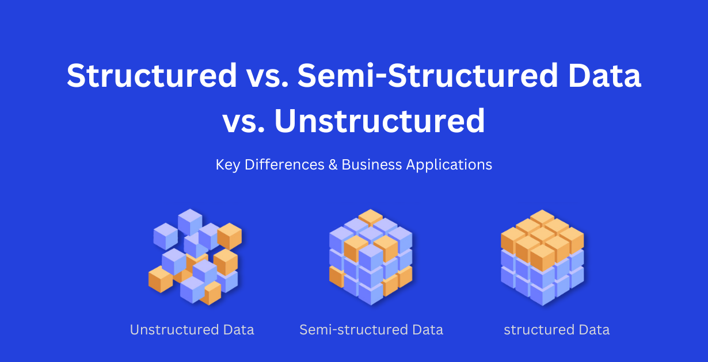
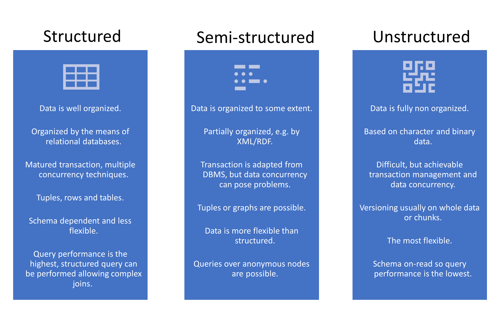
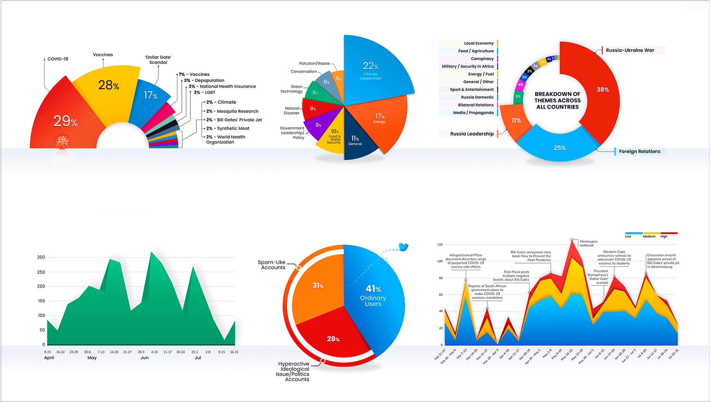

# What is Data?

Data is a collection of raw facts, figures, observations, or information that can be processed and interpreted to gain meaning. It may be in the form of numbers, text, images, audio, video, or records. In simple words, data is the raw material used to generate useful information.

Examples of data:
- Age of students
- Sales numbers of a company
- Customer names and addresses
- Temperature readings from sensors
- Website visit counts

## Types of Data

### 1. Structured Data
Structured data is organized in a fixed format, usually stored in tables or databases. It is easy to search, filter, and analyze.

Examples:
- Excel sheets
- SQL database tables
- CSV files

### 2. Semi-Structured Data
Semi-structured data does not follow a strict table format but still has some organization, such as tags or labels.

Examples:
- JSON files
- XML files
- Log files

### 3. Unstructured Data
Unstructured data is not arranged in a fixed format, so it is harder to process without special tools.

Examples:
- Emails
- Social media posts
- Audio and video files
- Images

## Why Data is Important?

Data is important because it helps us understand patterns, trends, and behaviors. Without data, decision-making becomes guesswork. Data helps businesses and organizations:
- Understand customer needs
- Track performance
- Improve operations
- Reduce risks
- Make better decisions

## What is Data Analytics?

Data analytics is the process of collecting, cleaning, organizing, analyzing, and interpreting data to find useful insights. It turns raw data into information that can help in decision-making.

## How Data is Used in Data Analytics

### 1. Data Collection
The first step is collecting data from different sources such as:
- Surveys
- Websites
- Social media
- Mobile apps
- Sales records
- Sensors and IoT devices

### 2. Data Storage
After collection, the data is stored in systems like:
- Excel
- Databases
- Cloud storage
- Data warehouses

### 3. Data Cleaning
Raw data often contains errors, duplicates, missing values, or inconsistent entries. Data cleaning removes these problems so that the data becomes reliable.

### 4. Data Processing and Transformation
The data is arranged and transformed into useful formats for analysis. This may include sorting, filtering, merging, and summarizing.

### 5. Data Analysis
Analysts use statistical, mathematical, and technical methods to discover patterns and relationships in the data. Some common types of analysis include:
- Descriptive analysis: What happened?
- Diagnostic analysis: Why did it happen?
- Predictive analysis: What is likely to happen in the future?
- Prescriptive analysis: What should we do?

### 6. Data Visualization
The results of analysis are often shown in charts, graphs, and dashboards to make the information easy to understand.

Examples:
- Bar charts
- Line graphs
- Pie charts
- Histograms
- Dashboards

### 7. Decision Making
The final goal of data analytics is to help people make smart and informed decisions. Organizations use these insights to improve products, reduce costs, and increase customer satisfaction.

## Real-Life Example

A retail company collects data on:
- Daily sales
- Customer purchases
- Product returns
- Customer feedback

By analyzing this data, the company can find:
- Which products are selling most
- Which customers buy the most
- Which months have the highest sales
- Why customers are returning products

Using these insights, the company can plan inventory, improve marketing, and increase profits.

## Conclusion

Data is the foundation of data analytics. It is the raw information collected from the real world, and when processed correctly, it becomes meaningful knowledge. In data analytics, data is used to understand patterns, solve problems, predict future trends, and support better decisions. In short, data is the fuel that powers modern business intelligence and analytics.

## Short Answer

Data is raw information, and in data analytics it is used to collect, clean, analyze, and interpret patterns to make better decisions and improve business performance.