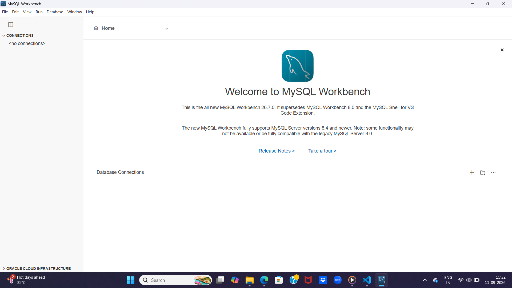
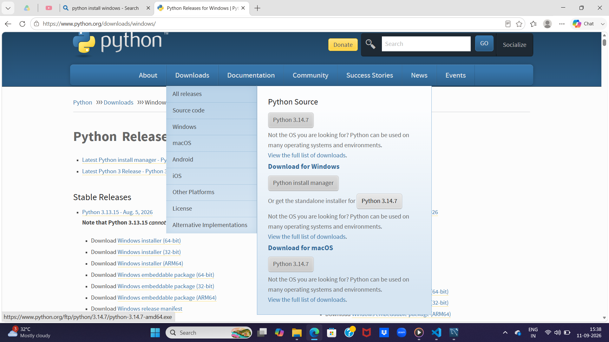
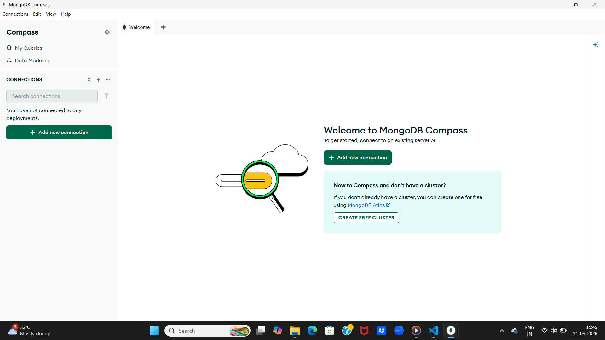
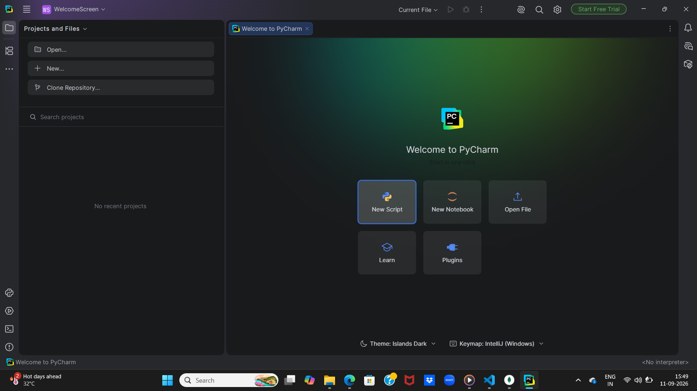

# software installation list 

1)  xampp server
   '''

   '''

   **X** : 

   **A**  :

   **M**  :

   **P**  :

2)  mysqlworkbench8.0

  '''
https://dev.mysql.com/downloads/file/?id=559064

  '''

3)  download and install python

**where to install**
'''
https://www.python.org/ftp/python/3.14.7/python-3.14.7-amd64.exe

4)  mongoDB compass
'''
https://downloads.mongodb.com/compass/mongodb-compass-1.50.0-win32-x64.exe
'''

5)  pycharm 
'''
https://download-cdn.jetbrains.com/python/pycharm-2026.2.2-aarch64.exe

'''

6)  visual studio code IDE
'''
https://code.visualstudio.com/download?_exp_download=fb315fc982#

'''

7)  jupyter notebook
 '''
Jupyter Notebook
Install the classic Jupyter Notebook with:

cmd   : pip install notebook

To run the notebook:

cmd    : jupyter notebook

To see the location of notebook

cmd    : pip show notebook
8)  excel 
9)  PowerBI 
10) numpy of python
cmd: pip install numpy

cmd: pip show numpy

11) seaborn for python 
cmd: pip install seaborn

cmd: pip show seaborn
12) pandas for python

cmd : pip install pandas
cmd: pip show pandas

13) matplotlib for python
cmd: pip install matplotlib
cmd: pip show matplaotlib